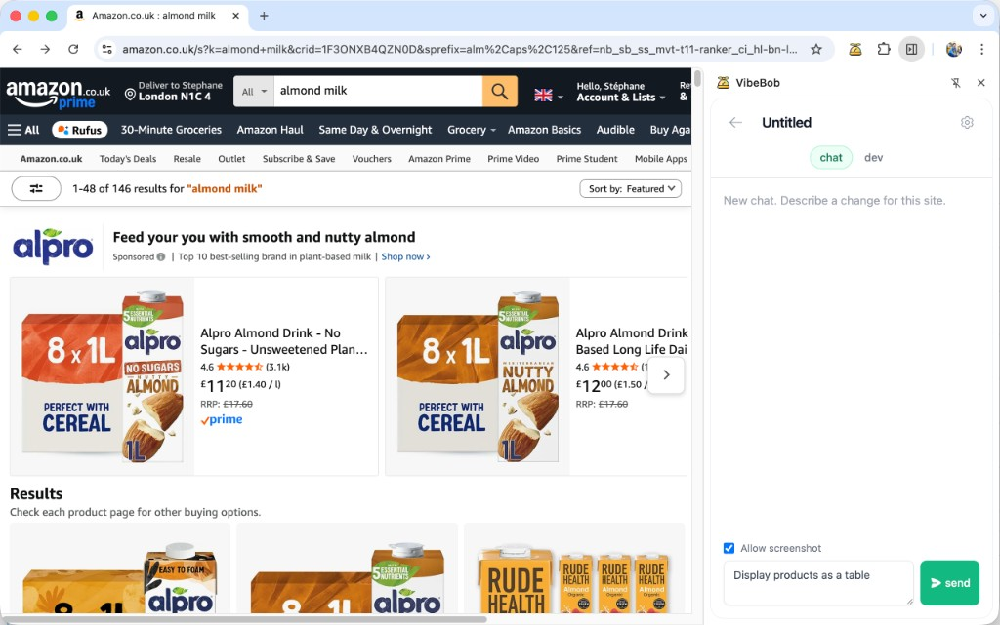
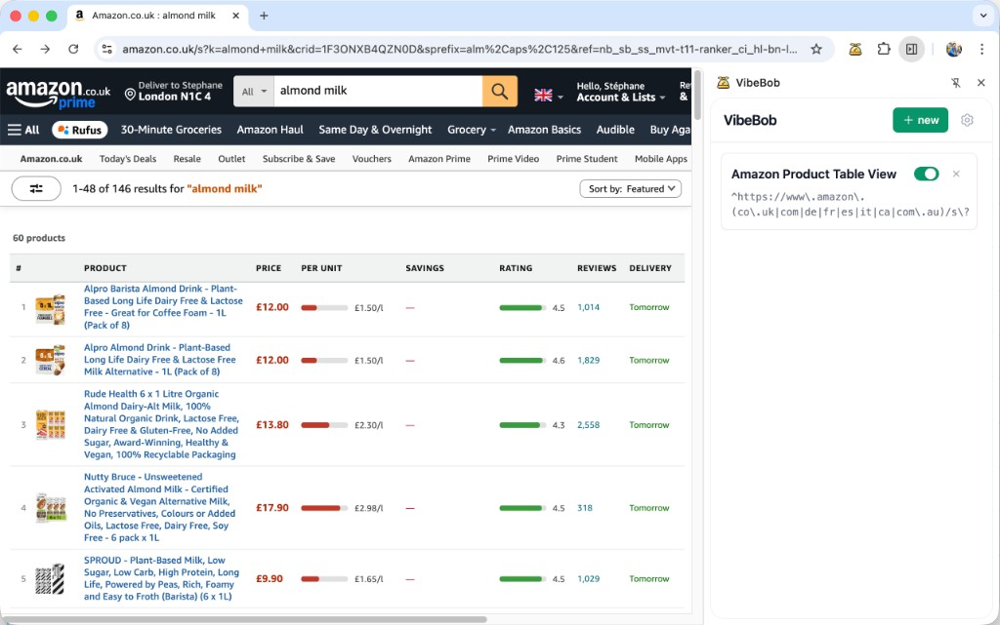

# VibeBob

Add custom features to any website by chatting with AI.

VibeBob is a Chrome extension that lets you describe UX improvements in plain English — an AI agent inspects the live page, writes the code, and injects it instantly. Features persist across sessions and auto-apply whenever you visit matching sites. No userscripts, no manual coding.

| Describe what you want | Get it live on the page |
|---|---|
|  |  |

## Install

> The extension is not yet on the Chrome Web Store. Install manually:

1. Download the [latest release zip](https://github.com/stephanecollot/VibeBob/releases) and unzip it
2. Open `chrome://extensions` in Chrome
3. Enable **Developer mode** (top right toggle)
4. Click **Load unpacked** and select the unzipped folder
5. Click the VibeBob icon in your toolbar, then paste your [Anthropic API key](https://console.anthropic.com/) in Settings

## How it works

1. **Open the side panel** on any website and click **New feature**.
2. **Describe what you want** — *"Add a CSV export button to this table"*, *"Make this sidebar collapsible"*, *"Add a dark mode toggle"*.
3. The agent inspects the page, writes JS+CSS, and applies it live. Iterate by chatting.

Every change is auto-committed to a per-feature git repo (in-browser, via IndexedDB). You can **revert** to any previous version, **toggle** features on/off, and everything persists across sessions.

## Features

- **Natural language to working code** — describe what you want, the agent builds it
- **Live hot-reload** — changes apply instantly without page refresh
- **Per-feature version control** — every edit is a git commit, revert to any point
- **URL-aware** — features auto-apply on matching sites, including SPA navigations
- **Toggle on/off** — disable any feature without deleting it
- **Error detection** — broken mods are flagged and errors surface in chat for easy fixing
- **Zero backend** — runs entirely in your browser with your own API key

## Development

```bash
pnpm install
pnpm dev
```

Then load the `dist` folder as an unpacked extension (see [Install](#install) above). Vite will hot-reload on changes.

### Package for Chrome Web Store

```bash
pnpm package
```

Builds and creates `vibebob.zip` ready for upload.

## Tech stack

- Chrome Manifest V3
- React + Tailwind CSS (side panel UI)
- Vite + [@crxjs/vite-plugin](https://crxjs.dev/vite-plugin)
- [Anthropic SDK](https://docs.anthropic.com/en/api) with streaming tool-use
- [isomorphic-git](https://isomorphic-git.org/) + LightningFS (IndexedDB-backed git)

## License

[MIT](LICENSE)
